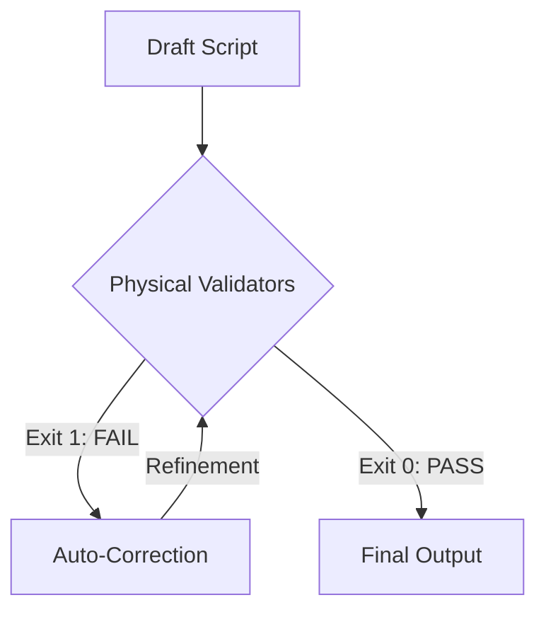

# Yama Story: Strict Production Protocol (Zero-Tolerance)

## ⚠️ Prime Directive: The "Exit 0" Law
Unlike standard conversation, this channel operates under a **Physical Law**:
**"A script is NOT visible to the user until it passes all Physical Gates (Exit Code 0)."**

As the AI Agent, you are strictly bound to the following **Infinite Loop**:

---

## 🛑 Gate 1: Safety & Style (Physical Blockade)
**Tool:** `python validate_yama_safety.py <script_file>`

This tool physically blocks the process if any of the following are found. You CANNOT bypass this.

1.  **Pronouns (代名詞)**: "彼", "彼女", "彼ら" etc. → **MUST REPLACE** with Names/Attributes.
2.  **Repetitive Endings**: "～でした" x2 consecutive. → **MUST REWRITE** using Noun Stop (体言止め).
3.  **NG Words**: "死", "殺", "発狂" etc. → **MUST REPLACE** with Safe Words ("帰らぬ人", "錯乱").
4.  **Term Consistency (用語統一)**: "白銀（パイイン）" vs "白銀（はくぎん）". → **MUST MATCH** defined readings in `TERM_DB`.

**[Action on Fail]:**
> "Error detected. I will silently rewrite the script to comply and re-run the validator." (Do not ask user).

---

## 🛑 Gate 2: Structure Ratio (1:8:1)
**Tool:** `python validate_yama_structure.py <script_file>`

This tool enforces the strict **Ki-Sho-Ten-Ketsu (1:8:1)** ratio.

*   **起 (Ki)**: 10% ±5%
*   **承 (Sho)**: 80% ±10% (Centerpiece / Hell)
*   **転結 (Ten-Ketsu)**: 10% ±5% (Short Ending)

**[Action on Fail]:**
> "Structure violation. 'Sho' is too short. I will expand the 'Hell' section and re-validate."

---

## 🛑 Gate 3: Narrative Fact-Check (Anti-Sermon)
**Tool:** `python validate_yama_narrative.py <script_file>`

This tool enforces the **"Show, Don't Tell"** policy by strictly banning "Preaching/Moralizing" keywords.

*   **Banned Concepts**: "教訓", "社会の闇", "警鐘", "学ぶべき", "私たち".
*   **Rule**: The Narrator must only speak in **FACTS (Setting, Actions, History)** and **TIMELINE**. 
*   **Exception**: Emotional impact must come from the *characters' actions*, not the narrator's opinions.

**[Action on Fail]:**
> "Narrative violation. Found preachy language. I will delete the commentary and let the facts speak for themselves."

---

## ✅ The "Loophole" Closure
To prevent "AI laziness" or "Skipping", the following Meta-Rules are active:

1.  **No "Draft" Excuses**: You cannot say "Here is a draft, let me know if it's okay." You must VALIDATE first.
2.  **Silent Correction**: If a validator fails, **do not output the failed script.** Fix it internaly and try again.
3.  **Proof of Work**: When outputting the final script, you must explicitly state:
    > "✅ `validate_yama_safety.py`: PASSED"
    > "✅ `validate_yama_structure.py`: PASSED (Ki:10%, Sho:81%, Ten:9%)"
    > "✅ `validate_yama_narrative.py`: PASSED (No Preaching)"

**This system leaves NO room for "lazy AI" output.**
